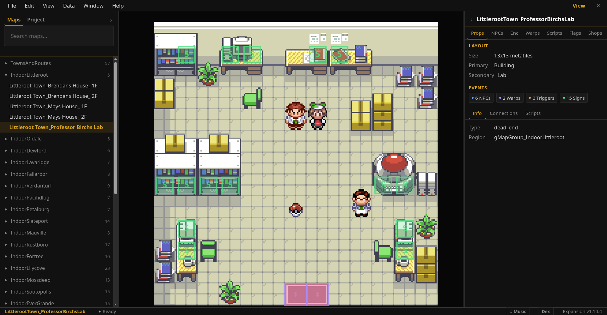
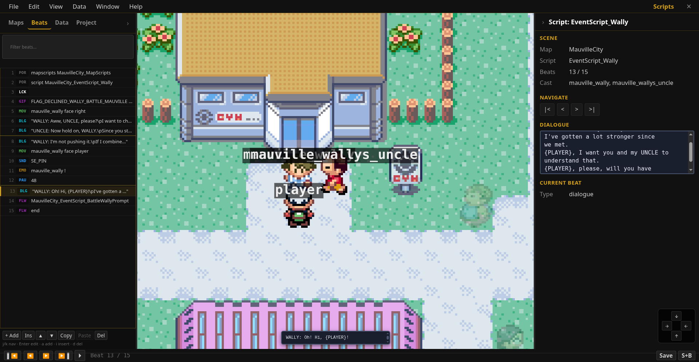
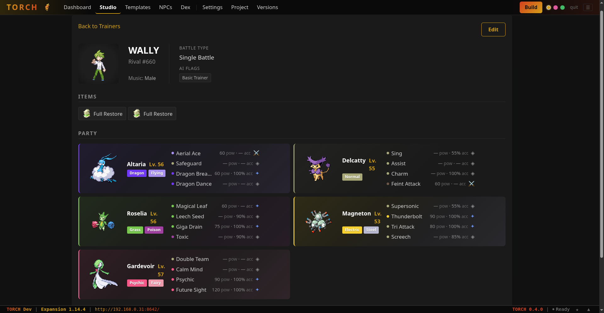
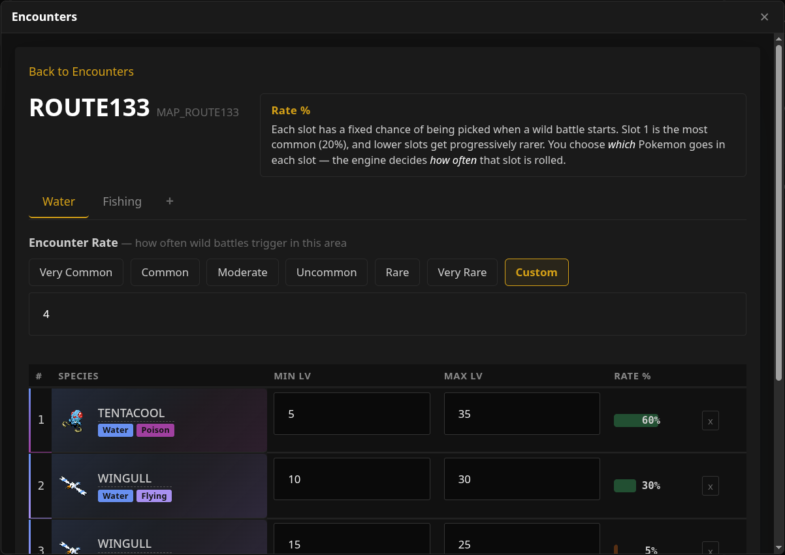
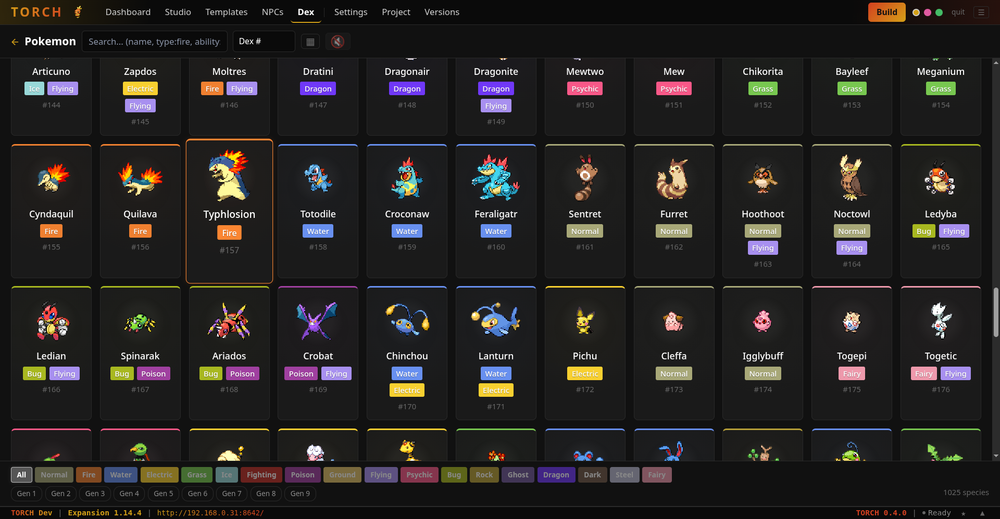
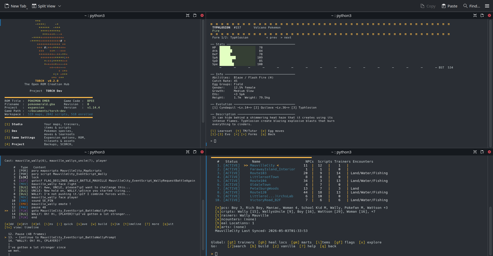

# TORCH

**The Open ROM Creation Hub** - a self-hosted ROM hacking IDE for [pokeemerald-expansion](https://github.com/rh-hideout/pokeemerald-expansion).

TORCH replaces the scattered workflow of ROM hacking - switching between text editors, Poryscript docs, Porymap, header files, and terminal commands - with a single tool that handles scripting, NPC editing, trainer and encounter management, content removal, and ROM building. Scripts are written in TorScript, a human-readable language that compiles to Poryscript automatically. Everything else is edited through a localhost web IDE or a full-featured terminal interface. Zero pip dependencies. Zero npm. Just Python and your pokeemerald project.



---

## What it does

### TORCH Studio

A three-panel workspace modelled after Porymap and RPG Maker. Map canvas on the left renders the selected map with NPC sprites at their actual positions. The right panel has eight tabs - Props, NPCs, Encounters, Warps, Scripts, Flags, Shops, Trainers - that load lazily when selected. NPCs can be created, edited, and deleted inline without leaving the canvas view.

Vanilla NPCs (those using the decomp's original `.pory` or `.inc` scripts) can be decompiled to editable TorScript in one click. The decompiler handles Poryscript control flow, movement blocks, trainer battles, and text inlining, reducing a typical vanilla script from hundreds of lines to a dozen.

### Script Editor



Scripts are composed as a sequence of "beats" - dialogue, movement, emotes, camera work, sound, flags, conditionals - each with a dedicated editor. A live GBA text preview renders text exactly as it appears in-game, including the font, box layout, and pagination. The compiler validates flag names, species, items, moves, music, and sound effects against your project's actual header files; typos are caught at compile time, not after a five-minute ROM build.

### Data Editors





### Dex



### TUI



Everything works from the terminal too. Scrolling list menus, inline editors, and a full script studio - no browser required. Useful for headless workflows or for users who prefer staying in the terminal.

---

## TorScript

TorScript is TORCH's scripting language. It compiles to Poryscript and handles the boilerplate that makes raw Poryscript tedious at scale.

```
@ Buster
alias buster npc5

label BusterScene
    lock
    buster face player
    "Hey, have you seen my Poochyena?"
    "I lost him near the lake..."
    emote buster !
    pause 30
    buster walk down 3
    "Oh wait, there he is!"
    flag set FLAG_MET_BUSTER
    end
```

| You write | Instead of |
|-----------|-----------|
| `"Hey there!"` | `msgbox` + format constants + auto-generated string labels |
| `buster walk up 3` | Movement data arrays + `applymovement` + `waitmovement` |
| `buster face down + player face down` | Separate movement blocks + `waitmovement` for each |
| `emote buster !` | Looking up `EMOTE_EXCLAMATION_MARK` |
| `give ITEM_POTION 3` | `giveitem` + bag-full check branching |
| `camera pan down 3` | `setcamerafocus` + offset tracking across the script |
| `clyde walkto player 0 1` | Runtime coordinate calculation + loop labels |
| `page 2 if FLAG_MET_BUSTER` | Manual flag checks + branching label structure |
| `pory somecommand(args)` | Direct pass-through for anything TorScript doesn't cover |

The decompiler goes the other direction: paste a `.pory` or `.inc` script and get TorScript back. A typical vanilla script decompiles at roughly 86% line reduction.

---

## Features

### Workspace and Sync
- **Map registry** - enroll maps, track sync health (`ok` / `stale` / `drift` / `orphan` / `new`)
- **Sync engine** - compile TorScript, snapshot workspace before every write, deploy to game project
- **Build assistant** - one-command ROM builds with pre-build safety checks (empty script sanitisation, missing `.inc` regeneration, Poryscript precompile) and error diagnosis
- **Verified snapshots** - automatic backups after every successful build, tiered retention

### Editors (Web GUI)
- **NPC Editor** - dialogue editing, 7 creation wizards (flavor NPC, sign, item giver, multi-state, nurse, PC, infrastructure sign), overworld sprite preview, health scan
- **Trainers** - party builder with species picker, AI flags with descriptions, EV/IV spreads, held items, `.party` format support
- **Encounters** - wild Pokemon by route, slot, and time-of-day variant
- **Dex** - searchable species browser with stats, learnsets, evolution chains, shiny sprites, form folding
- **Flags** - cross-reference scanner, orphan reclamation, bulk operations
- **Items / Moves / Shops / Learnsets / Heal Locations** - data editors for the full game config surface

### Content Management
- **SCORCH Singe** - selective vanilla content removal by category (maps, trainers, encounters, frontier, scripts, tilesets, graphics, music)
- **SCORCH Phoenix** - full wipe of all vanilla maps, trainers, and encounters; tested across every expansion version from v1.6.0 to latest; works on a fresh clone with no prior build
- **Building Templates** - `torch template pokecenter Route101 --door 10,5` stamps a complete PokeCentre or Mart interior with layout, scripts, warps, and heal location registration in one command
- **Tileset Assistant** - import tilesets from other decomps (FireRed, etc.) with automatic metatile format conversion
- **Decompiler** - convert existing `.pory` and `.inc` scripts to TorScript; click a vanilla NPC in Studio and hit "Convert to Editable"

### Project Lifecycle
- **Multi-project support** - switch between ROM hacks via config
- **Expansion compatibility** - auto-detects expansion version at runtime, gates features accordingly (v1.6.0 through latest, plus vanilla pokeemerald with no expansion)
- **Backups** - tiered retention with verified build snapshots and point-in-time restore
- **Project forking** - clone the active project for experimentation without risk
- **Music browser** - browse and preview game tracks with GBA-accurate rendering via poryaaaa or a built-in MIDI synth fallback

### Worldstate Simulator

Toggle flags and variables in a side panel and watch NPCs ghost, move, and swap sprites in real time on the map canvas. Useful for checking that conditional NPC states look correct without building the ROM.

---

## Requirements

- **Python 3.11+** - stdlib only, nothing to install
- A [pokeemerald](https://github.com/pret/pokeemerald) or [pokeemerald-expansion](https://github.com/rh-hideout/pokeemerald-expansion) v1.6.0+ project, set up and buildable
- [Poryscript](https://github.com/huderlem/poryscript) on your PATH
- [devkitPro](https://devkitpro.org/) toolchain (for ROM builds)

---

## Quick Start

```bash
# Clone TORCH
git clone https://github.com/eagredev/TORCH.git ~/torch

# First-time setup - detects your project, creates config
python3 ~/torch init

# Open the web IDE (starts a local server, opens in your browser)
python3 ~/torch studio

# Or use the terminal interface
python3 ~/torch
```

### Basic workflow

```bash
# Enroll your maps so TORCH can track them
python3 ~/torch enroll --all

# Open a map in Studio, edit NPCs and scripts visually
python3 ~/torch studio

# Compile a single TorScript file
python3 ~/torch MyScript.txt

# Sync a map (compile + snapshot + deploy to game project)
python3 ~/torch sync Route101

# Build the ROM
python3 ~/torch build
```

---

## Commands

| Command | What it does |
|---------|-------------|
| `torch` | Main menu |
| `torch studio` | Web IDE |
| `torch script MapName` | Script editor for a specific map |
| `torch sync [MapName]` | Compile and deploy (all enrolled maps or one) |
| `torch build` | Build ROM with auto-sync and error diagnosis |
| `torch status` | Show enrolled maps with health indicators |
| `torch enroll [--all]` | Register maps for tracking |
| `torch scorch` | SCORCH wizard (vanilla content removal) |
| `torch template` | Stamp building interiors from templates |
| `torch trainers` | Trainer editor |
| `torch encounters` | Encounter editor |
| `torch music` | Music browser and preview |
| `torch flags [MapName]` | Flag browser and cross-reference scanner |
| `torch shops [MapName]` | Shop editor |
| `torch config` | Configuration manager |
| `torch restore` | Restore from verified build snapshot |
| `torch decompile <file>` | Convert `.pory` or `.inc` to TorScript |

---

## Documentation

- User guide: [`docs/guide.md`](docs/guide.md)
- TorScript syntax reference: [`docs/syntax_reference.txt`](docs/syntax_reference.txt)

---

## Built on

TORCH builds on the work of the pokeemerald decomp community:

- [pret/pokeemerald](https://github.com/pret/pokeemerald) - the decompilation that makes ROM hacking at this level possible
- [rh-hideout/pokeemerald-expansion](https://github.com/rh-hideout/pokeemerald-expansion) - modern battle engine, overworld systems, and expansion features
- [huderlem/poryscript](https://github.com/huderlem/poryscript) - the scripting language TORCH compiles to
- [huderlem/porymap](https://github.com/huderlem/porymap) - the map editor that informed Studio's design

---

## Scale

| | |
|---|---|
| **Production modules** | 117 Python + 110 JavaScript |
| **Lines of code** | ~155k Python + ~53k JavaScript |
| **Test suites / tests** | 92 suites / 5,000+ tests |
| **Web views** | 21 |
| **TorScript commands** | 30+ |
| **Expansion versions supported** | v1.6.0 through latest + vanilla pokeemerald |
| **External dependencies** | 0 |

---

## License

**Source-available. All rights reserved.**

The source code is publicly visible for reference and personal use. It is not open source - you may not redistribute, sublicense, or use it as the basis for a competing tool without permission.

A permissive open source license (likely MIT) is planned for a future release. This notice will be updated when that happens.

---

## Contributing

This is a solo project and PRs are not being accepted at this time. If you find a bug or have a feature request, open an issue - no guarantees on response time or resolution, but issues are read.

When the project moves to an open source license, contribution policy will be revisited.
